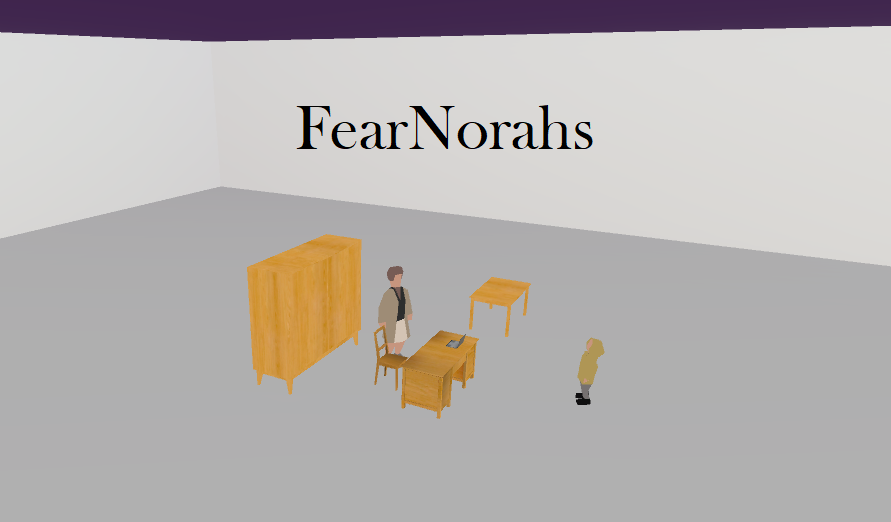
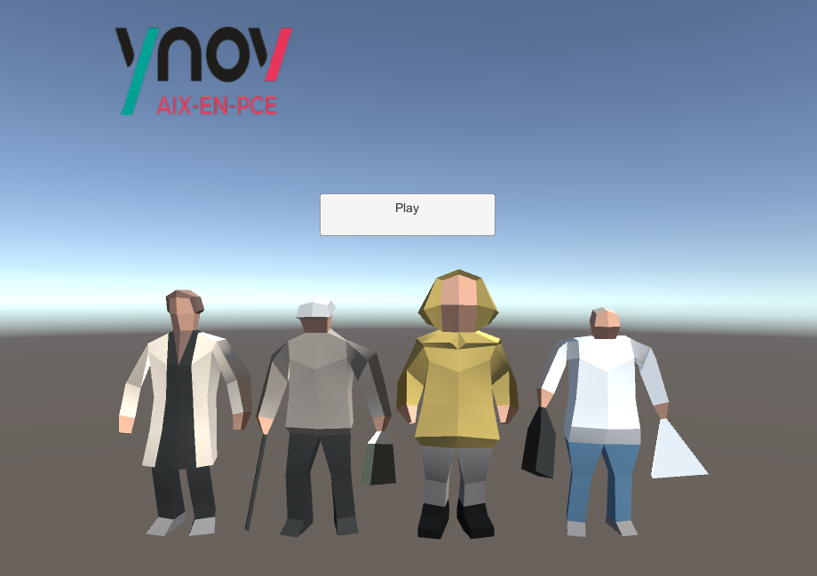
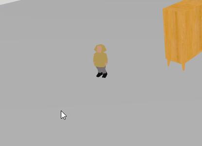
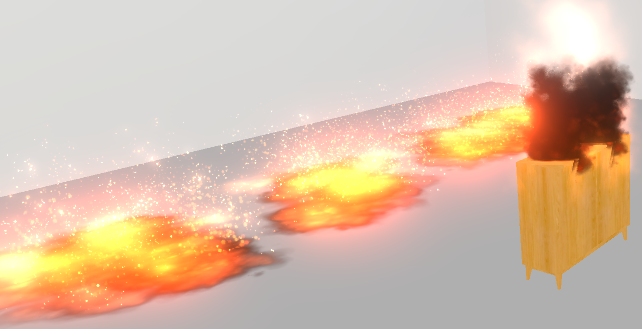

# FearNorahs

FearNorahs est un Serious Game développé sur Unity dans le cadre d'un projet scolaire mené à Ynov Aix Campus



# TL;DR

  - Norahs a des questions à vous poser, j'espère que vous êtes sans faille sur le règlement d'Ynov.
  - Une bonne réponse va l'énerver, mais vous ne serez pas brûlé, par contre une mauvaise réponse...

> Toute ressemblance avec 
> des personnes existantes 
> ou ayant existé est 
> purement fortuite. 


## Installation

```sh
$ git clone https://github.com/Aleqsd/FearNorahs.git
```

Compilez le projet sous Unity 2018, ou utilisez le Build.zip dans UnityProject/ pour récupérer directement l'executable.


## Fonctionnalités

Voici les features du jeu :

#### Character Picker
Choisissez quel personnage vous allez incarner.



#### Point-and-click
Déplacez vous en point-and-click, ciblez votre destination.



#### Environnement évolutif
Vos actions auront des conséquences !



#### Système de dialogue
Votre réponse va définir votre avenir...


